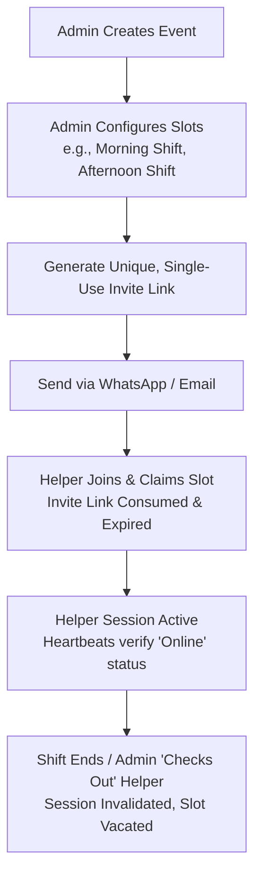

# Asistir: Product Strategy, Security & Shift Blueprint

This blueprint outlines the operational flow, database schema refinements, and designs for **invitation distribution, staff limits, shift rotation, ephemeral link security, and the helper frontend routing architecture** in **Asistir**.

---

## 1. Core Architecture: Event First, then Roles

An event is the **parent container** for all activities.
1. **The Admin** creates an **Event** (enters "Draft Mode").
2. **The Admin** defines the **Job Scopes / Role Slots** needed (e.g. "Reception - Morning Shift", "Usher - Hall B").
3. **The Admin** generates and sends targeted, ephemeral invite links directly to helpers.
4. **The Helpers** click the link, enter their name, and instantly claim that specific slot.



---

## 2. Dual-Token Security Model: Ticket vs. Wristband

To achieve world-class security while ensuring a seamless, frictionless user experience on mobile devices, Asistir implements a **Dual-Token Handshake**. The database schema is already fully optimized to support this architecture.

```
+-------------------------------------------------------------------------------+
|                               THE DUAL HANDSHAKE                              |
|                                                                               |
|  [Admin Shared Link]                                                          |
|         |                                                                     |
|         v                                                                     |
|  Token 1: inviteToken  =======> [Validated on Server]                         |
|  (The "Movie Ticket")                  |                                      |
|                                        v                                      |
|                               [Torn & Consumed]                               |
|                                        |                                      |
|                                        v                                      |
|  Token 2: liveStaff.accessToken <=== [Generated on Server]                    |
|  (The "Wristband")                     |                                      |
|                                        v                                      |
|                               [Saved to LocalStorage]                         |
+-------------------------------------------------------------------------------+
```

### 🎟️ Token 1: The `inviteToken` (The "Movie Ticket")
*   **Database Field:** [roleSlots.inviteToken](file:///Users/alvinwong/attendance_project/convex/schema.ts#L68)
*   **Transmission:** Appended as a query parameter in the invitation URL sent via WhatsApp or Email:  
    `asistir.app/live/$eventId?inviteToken=inv_abc123`
*   **Security Properties:** Cryptographically random, non-semantic (un-guessable), and has an expiry timestamp (`inviteTokenExpiresAt`).
*   **Lifecycle:** 
    *   Acts as a **single-use admission ticket**.
    *   The moment the usher clicks the link, inputs their name, and claims the role, the `inviteToken` is **torn and consumed** (deleted/set to `undefined` in the database).
    *   Any subsequent attempts to use the same link will fail instantly with a *"This invite link has already been claimed"* error, preventing unauthorized link sharing or duplicate claims.

### ⌚ Token 2: The `liveStaff.accessToken` (The "Access Wristband")
*   **Database Field:** [liveStaff.accessToken](file:///Users/alvinwong/attendance_project/convex/schema.ts#L84)
*   **Transmission:** Generated on the secure server during the claim mutation and returned in the encrypted API response directly to the usher's browser.
*   **Security Properties:** Stored privately inside the browser's **`localStorage`**.
*   **Lifecycle:** 
    *   Acts as their **permanent shift keycard or access wristband**.
    *   Once saved in `localStorage`, the frontend immediately scrubs the `inviteToken` from the browser address bar to keep the URL clean.
    *   If the usher accidentally closes their browser tab, refreshes the page, or restarts their phone, **they are NOT logged out**. The app reads the `liveStaff.accessToken` from `localStorage` on load, hands it to Convex, and instantly reinstates their active session without asking for their name or role again.

---

## 3. Operational Operational Safeguard: The "Reset Role" Recovery

### The Real-World Scenario
An usher claims their role slot, which consumes and invalidates the `inviteToken`. Later, the usher accidentally deletes their browser cookies (losing their `localStorage` wristband), loses their phone, or deletes their WhatsApp chat. If the Admin resends the original link, the usher is blocked because the `inviteToken` is already dead.

### The Chosen Solution: Option A - The "Reset Role" Flow
To keep the database clean and minimize complex code overhead, Asistir utilizes the **Reset Role** pattern:

1.  **The Admin Action:** On their live supervisor dashboard, next to the assigned role, the Admin clicks **"Unassign / Reset Role"**.
2.  **The Database Cleanup:** The Convex backend:
    *   Unlinks the user by setting `assignedStaffId: undefined` on [roleSlots](file:///Users/alvinwong/attendance_project/convex/schema.ts#L59) (marking the position vacant again).
    *   Marks the rogue/lost usher's session as `status: "checked_out"` on [liveStaff](file:///Users/alvinwong/attendance_project/convex/schema.ts#L79), instantly blocking any further heartbeats from their old device.
    *   **Generates a brand-new, active `inviteToken`** on the vacant slot.
3.  **The Redistribution:** The Admin copies the newly generated invite link and forwards it to the usher.
4.  **The Restoration:** The usher clicks the new link, types their name, and safely rejoins the shift in under 5 seconds!

---

## 4. Real-Time Security & Instant Dismissal Architecture

Every query or mutation executed by a helper (sending chat messages, claiming jobs, viewing rosters) is verified through a secure session validator.

To prevent unlimited access after an event is over, **access is bound strictly to the Event's Status**. The moment an event is archived (either after its 24-hour expiration passes or when the Admin manually closes the session), **every `accessToken` for that event is instantly and simultaneously revoked**!

```typescript
/**
 * Validates that a helper's session is active and authorized.
 * Throwing an error here instantly blocks rogue/dismissed helpers.
 */
export async function validateStaffSession(ctx: any, eventId: any, accessToken: string) {
  const staff = await ctx.db
    .query("liveStaff")
    .withIndex("by_accessToken", (q: any) => q.eq("accessToken", accessToken))
    .first();

  if (!staff || staff.status === "checked_out") {
    throw new Error("Invalid session: Access Denied");
  }

  // 🚨 THE MASTER SECURITY GATE: Verify parent event status
  const event = await ctx.db.get(eventId);
  if (!event || event.status === "archived" || (event.expiresAt && Date.now() >= event.expiresAt)) {
    throw new Error("Unauthorized: This event has ended and access has expired.");
  }

  // Update heartbeat so Admin knows they are online
  await ctx.db.patch(staff._id, { lastActive: Date.now() });
  
  return staff;
}
```

### Instant Access Revocation Flow
1. **The Dismissal:** Admin clicks "Dismiss" on the helper. The mutation deletes the helper's `liveStaff` record or sets its status to `"checked_out"`.
2. **Real-time Blocking:** The next millisecond, the helper's device makes a real-time query (e.g., loading new messages). The Convex validator detects their record is invalid/checked out and throws an error.
3. **Frontend Invalidation:** The React frontend catches this authentication error, immediately purges their `localStorage` token, and redirects them to a secure `/access-revoked` page. They are instantly locked out.

---

## 5. Recurring Events: One-Click Event Cloning (Templates)

To prevent repeat organizers (churches, clubs, weekly promoters) from having to re-create their entire event setup from scratch every single week, Asistir implements a **One-Click Event Cloning (Template) Flow**.

Instead of introducing a separate, complex "Templates" table, **any past or archived event can act as a template**.

### The Cloning Flow
On the Admin's dashboard, next to any archived event, they click **"Clone Event"** or **"Use as Template"**. This invokes a backend mutation `events:cloneEvent` that copies the blueprint while resetting all live shift data:

```typescript
// Inside Convex cloneEvent mutation:
export const cloneEvent = mutation({
  args: { originalEventId: v.id("events"), newTitle: v.string(), newEventDate: v.number() },
  handler: async (ctx, args) => {
    const original = await ctx.db.get(args.originalEventId);
    if (!original) throw new Error("Original event not found");

    // 1. Create a brand-new Event in DRAFT mode ($0 cost)
    const newEventId = await ctx.db.insert("events", {
      adminId: original.adminId,
      title: args.newTitle,
      joinCode: generateUniqueJoinCode(), // Fresh join code
      maxStaff: original.maxStaff,
      status: "draft",                    // Must start in draft
      tier: original.tier,
      location: original.location,
      startTime: original.startTime,
      endTime: original.endTime,
      description: original.description,
      sections: original.sections,        // Copies your setup areas!
      createdAt: Date.now(),
    });

    // 2. Clone all Job Scopes / Role Slots (vacant & ready for fresh invites)
    const originalSlots = await ctx.db
      .query("roleSlots")
      .withIndex("by_event", (q) => q.eq("eventId", args.originalEventId))
      .collect();

    for (const slot of originalSlots) {
      await ctx.db.insert("roleSlots", {
        eventId: newEventId,
        title: slot.title,
        role: slot.role,
        section: slot.section,
        timeSlot: slot.timeSlot,
        description: slot.description,
        
        // 🔒 FRESH Ephemeral Security Tokens for the new week
        inviteToken: generateSecureInviteToken(), 
        inviteTokenExpiresAt: args.newEventDate + (24 * 60 * 60 * 1000), // Expires at end of event day
        
        // ❌ Vacate assignments (old staff are not copied over)
        assignedStaffId: undefined, 
      });
    }

    return newEventId;
  }
});
```

### 💎 Why this is an absolute game-changer:
1.  **Saves 99% of Setup Time:** The organizer doesn't have to re-enter 10 different sections or manually re-create 15 role slots every week. They copy the setup with a single click.
2.  **No Cost for Drafts:** Cloned events are created as `draft` ($0 cost). They only consume a monetization credit when the organizer clicks **"Go Live"** on the event day, fitting our credit strategy perfectly!
3.  **Historical Cleanliness:** The new event gets a fresh database ID, ensuring that last week's chat history (`messages`) and task lists (`jobs`) are kept completely separate and organized.

---

## 6. Helper / Invited Member Frontend Routing Architecture

The helper experience has completely different design requirements than the Admin's view:
*   **Mobile-First Design:** Helpers are walking around the venue with their phones. They need big, finger-friendly tap targets, simple workflows, and no complex menus.
*   **No Accounts Needed:** Helpers enter their name on joining but do not register a traditional email/password account. Auth is purely based on the session token saved in `localStorage`.
*   **Bottom Navigation Bar:** Unlike the Admin's desktop `AppSidebar`, helpers get a clean, app-like bottom navigation menu.

### Proposed Routing System (TanStack Router)

To keep URLs clean and simple for mobile users, we avoid placing complex database IDs in the URL. Instead, helper routes are generic, reading the active event context directly from their secure `localStorage` token:

```
/
├── join/
│   └── $joinCode              <-- Onboarding / Slot Selection page (public)
└── live/
    ├── index.tsx          <-- Helper Dashboard (My active tasks, announcements)
    ├── jobs.tsx           <-- Helper Job Queue (View & report tasks)
    ├── chat.tsx           <-- Real-time Chat Rooms (Announcements, general)
    └── profile.tsx        <-- Current Slot details & self checkout
```

### Detailed Route Breakdown

#### 1. Onboarding (`/join/$joinCode?token=...`)
*   **Type:** Public Route.
*   **Purpose:** The entry point from WhatsApp/Email. It displays the event details (Wedding name, date, venue, dress code) and shows the specific slot they are claiming.
*   **Action:** Helper inputs their name and taps **"Claim Role & Join"**. The app triggers `slots:claimSlot` and saves the returned `helperSessionToken` in `localStorage`.
*   **Redirect:** Redirects them straight into the live dashboard: `/live`.

#### 2. Live Layout (`/live`)
*   **Type:** Ephemeral Staff Guard Route.
*   **Layout:** Renders a gorgeous mobile viewport with a **Bottom Navigation Bar** consisting of:
    *   **Home/Dashboard (`/live`):** General status, venue details, notes.
    *   **Chat (`/live/chat`):** Real-time channels based on role access.
    *   **Jobs (`/live/jobs`):** Real-time job queues for task management.
    *   **Profile (`/live/profile`):** Details about their role slot and a "Check Out / End Shift" button.
*   **Auth Guard:** Before loading any children, the layout verifies if `localStorage.getItem("staffToken")` exists and is active. If it fails validation, it redirects to `/access-revoked`.

#### 3. Job Queue (`/live/jobs`)
*   **Type:** Real-time Interactive Board.
*   **Purpose:** Where tasks are listed.
*   **Ushers** can see tasks assigned to them and press a floating action button to "Report Issue" (which creates a job for supervisors).
*   **Supervisors** can see all active/pending jobs and assign them.

#### 4. Chat Rooms (`/live/chat`)
*   **Type:** Real-time Messaging Board.
*   **Purpose:** Channel-based real-time communication.
*   *   `#announcements`: Read-only for general ushers, broadcast-only for supervisors.
*   *   `#general`: Open discussion for all active helpers.
